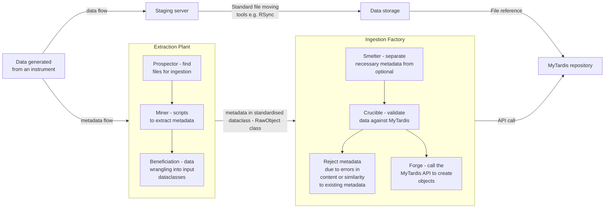

# Scoping and design docs for server-side validation

## Purpose

The reason for moving to server-side validation of ingested data is to build robustness into the ingestion pipeline. Server-side validation allows for incomplete models to be ingested and flagged for review by appropriate users. This will ensure that the ingestion pipeline is not stopped due to metadata incompleteness, which is a potential outcome of the current client-side validation model.

## Current state - client-side validation

An overview of the ingestion pipeline is illustrated.

Moving to server-side validation removes the need for the 'Crucible' step in the 'Ingestion Factory'; otherwise, the ingestion pipeline remains unchanged.

The purpose of the 'Crucible' step is data validation. To achieve this, the Crucible class makes API calls to MyTardis and compares the resulting returns against the data prepared for ingestion. If an exact match can be found, then the Crucible class notes that an object exists within MyTardis and replaces it with a reference to the extant object.

If there is no match, then the Crucible class assumes that there is no extant object and calls the Forge to create the object. The difficulty arises when there is a partial match. Taking a position of 'least harm' obligates the ingestion process to stop at this point in order not to:

1. Overwrite extant data/metadata or
2. Misassign access to the data generated.

This represents a significant point of potential failure, where the client-side ingestion scripts need to catch and appropriately handle data errors and process errors, overly complicating the error handling routines in the ingestion scripts and introducing a point of weakness into the ingestion pipeline.

## Desired state - server-side validation

In contrast, moving the validation server-side can and will create an object in MyTardis. Where there is a partial match, this can be flagged for user intervention without halting the ingestion process. Furthermore, by moving the validation server-side, error handling client-side is simplified and can focus on catching breaking exceptions, indicating more severe problems with the ingestion scripts.

Moving to this model requires building additional capability into MyTardis, such that there are temporary models available to hold the unvalidated metadata until it has been validated (and corrected if necessary).

There also needs to be an asynchronous job set up, which can run periodically to check the status of unvalidated models and migrate them into validated models, as and when they become valid.

### Proposed data structures for server-side validation

In order to create the main data types within MyTardis we would need to replicate these as 'temporary' models. This includes the four objects in the hierarchy, Projects, Experiments, Datasets and Datafiles, as well as their associated parametersets and parameters.