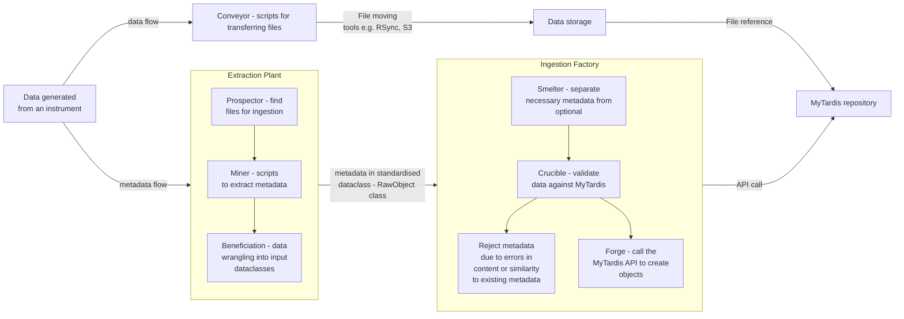
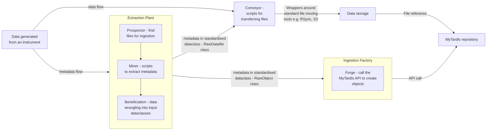
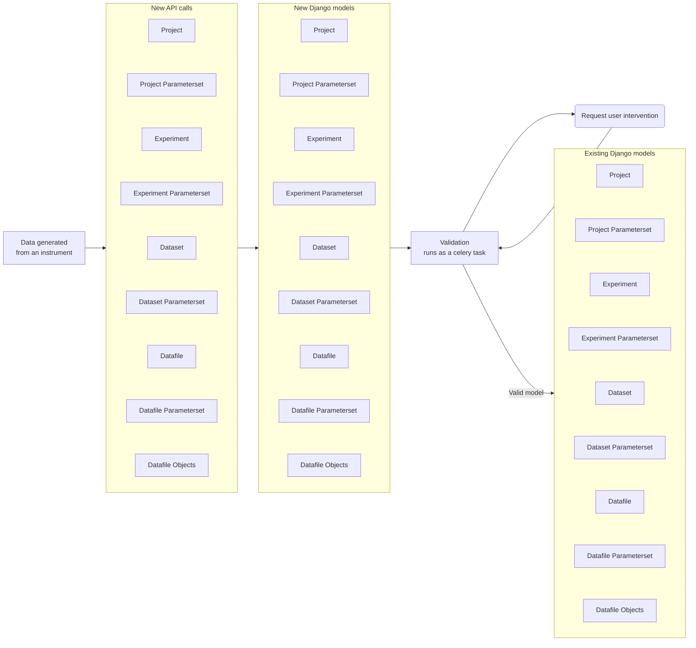

# Scoping and design docs for server-side validation

## Purpose

The reason for moving to server-side validation of ingested data is to build robustness into the ingestion pipeline. Server-side validation allows for incomplete models to be ingested and flagged for review by appropriate users. This will ensure that the ingestion pipeline is not stopped due to metadata incompleteness, which is a potential outcome of the current staging-side validation model.

## Current state - staging-side validation

An overview of the ingestion pipeline is illustrated.

Moving to server-side validation removes the need for the 'Crucible' step in the 'Ingestion Factory'; otherwise, the ingestion pipeline remains unchanged.

The purpose of the 'Crucible' step is data validation. To achieve this, the Crucible class makes API calls to MyTardis and compares the resulting returns against the data prepared for ingestion. If an exact match can be found, then the Crucible class notes that an object exists within MyTardis and replaces it with a reference to the extant object.

If there is no match, then the Crucible class assumes that there is no extant object and calls the Forge to create the object. The difficulty arises when there is a partial match. Taking a position of 'least harm' obligates the ingestion process to stop at this point in order not to:

1. Overwrite extant data/metadata or
2. Misassign access to the data generated.

This represents a significant point of potential failure, where the staging-side ingestion scripts need to catch and appropriately handle data errors and process errors, overly complicating the error handling routines in the ingestion scripts and introducing a point of weakness into the ingestion pipeline.

## Desired state - server-side validation

In contrast, moving the validation server-side can and will create an object in MyTardis. Where there is a partial match, this can be flagged for user intervention without halting the ingestion process. Furthermore, by moving the validation server-side, error handling staging-side is simplified and can focus on catching breaking exceptions, indicating more severe problems with the ingestion scripts.

Moving to this model requires building additional capability into MyTardis, such that there are temporary models available to hold the unvalidated metadata until it has been validated (and corrected if necessary).

There also needs to be an asynchronous job set up, which can run periodically to check the status of unvalidated models and migrate them into validated models, as and when they become valid.

### Proposed data structures for server-side validation

In order to create the main data types within MyTardis we would need to replicate these as 'temporary' models. This includes the four objects in the hierarchy, Projects, Experiments, Datasets and Datafiles, as well as their associated parametersets and parameters.

The modified ingestion process is shown:

in this ingestion pathway, there is no validation of the data that is used to create the objects. Partially completed or objects with conflicted metadata (namespaces etc.) will be created in a 'staging' model and validation of the metadata carried out asynchronously on the server.

This process is represented diagramatically as:

## Development requirements

In order to implement this server-side validation approach the following functionality needs to be developed.

### API changes

The existing API provider, tastypie, is currently no longer under active development and is likely to, at some point in the future, become deprecated. It makes sense, while developing new API endpoints for MyTardis, to migrate to the Django REST framework. This can be done piecemeal, with the server-side validation changes being an obvious first candidate. This framework defines two types of object, as serializer class, that provide a translation between Python datatypes and the model data in django. This fulfills the same role as the hydrate/dehydrate cycle in tastypie.

The other object type is a view (or viewset) which handle the request/response side of the REST API. For a given object in the list above, therefore, both a serializer and a view needs to be defined.

This needs to leverage the authentication/authorisation framework that has been built in MyTardis, using the ACL development that was previously implemented.

### Staging models

Staging models that are directly analagous to the existing models in MyTardis will need to be created. These will not have any restrictions on them and should all be allowed to be blank/null with the exception of the miminimum required to identify and ingested datafile. Specifically this will need a filepath, a user (which may be inferred from the instrument via the facility management) and a storagebox (which may be a staging environment).

A new set of associated APIs for staging models need to be created. This will enable new objects, including incomplete objects to be generated.

### Validator

A celery task, or celery tasks, will need to be developed that check for:

- Namespace collisions
- Incomplete metadata
- Conflicting values in descriptions/names/identifiers
- Missing ACLs

In addition, the validator task should look up names and identifiers and convert these into URIs of existing models, where such models exist.

Once an object has been validated, the task should create new object in MyTardis and then remove the object from the staging models. This may also include migrating the existing DFO to new DFOs based on project level storage boxes.

### Web forms/views

New or modified web forms will be needed to allow user intervention where there are invalid objects in the staging area. The invalid objects may come from errors in ingestion configuration, or instrument workflows that require manual entry of project structure and schema metadata.

This should include an option for facility managers to assign datafiles to users for them to intervene. An indication of fields that are in conflict should be made and the option to connect to existing objects, within the user's/group's access, should be available to lower the barrier for researchers needing to assign objects appropriately.